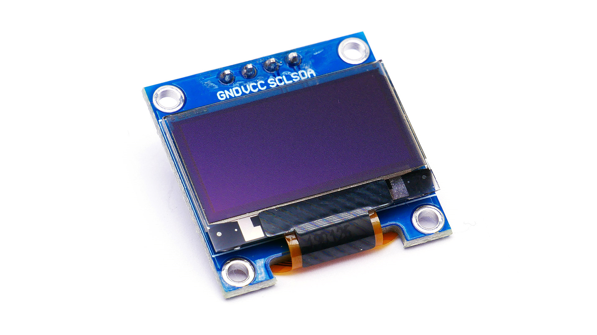

# Pantalla LED
# Por: Jesus Bustamante

.....
.....
.....

|          **Módelo**          | **Pulgadas** | **Costo** | **Píxeles** |  **Voltaje** |
|:----------------------------:|:------------:|:---------:|:-----------:|:------------:|
|            SSD1306           |     0.96"    |    $135   |   128 X 64  | 1.65V a 3.3V |
| LCD TFT 2.8plg Touch ILI9341 |     2.8"     |    $300   |  240 x 320  |     3.3V     |
