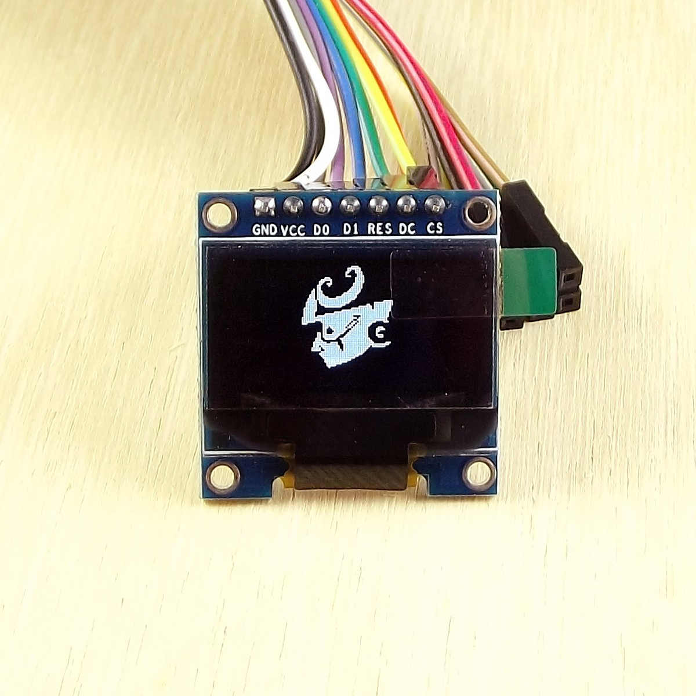
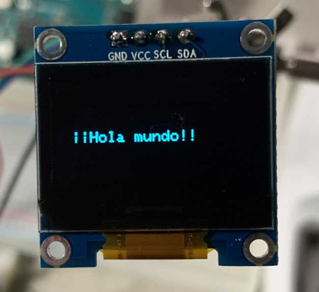
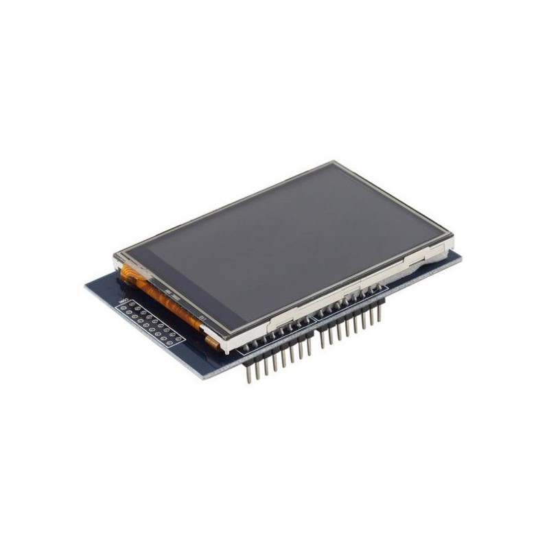
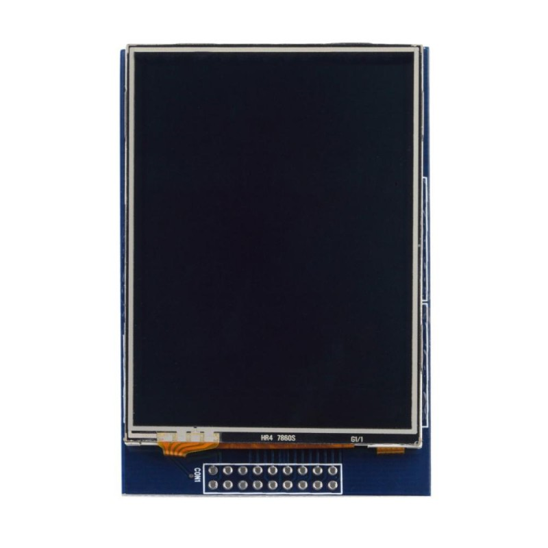
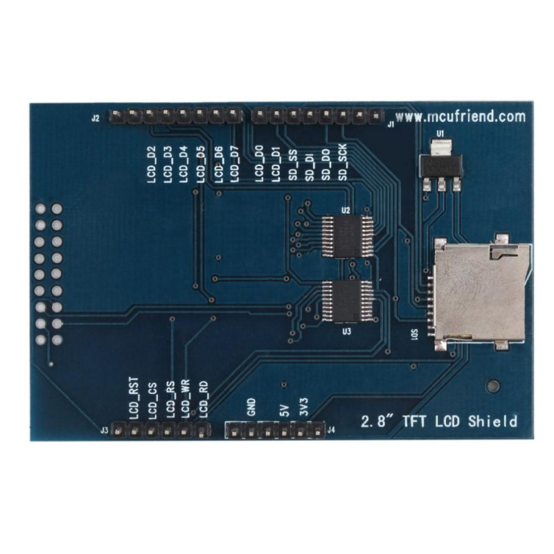

# Pantalla LED y LCD, COMPARATIVA
# Por: Jesus Bustamante

En el siguiente material apreciaremos la diferencia de las pantallas.
Para ello iniciaremos con:

Las pantallas OLED se destacan por su gran contraste, mínimo consumo de energía y buena calidad de imagen. El display oled 0.96" SPI SSD1306 posee una resolución de 128*64 píxeles, permitiendo controlar cada píxel individualmente y mostrar tanto texto como gráficos. Además por ser de tipo OLED no necesita de retroiluminación (Backlight) como los LCD, lo que hace que su consumo de energía sea mucho menor y aumenta su contraste.

Para manejar la pantalla es necesario utilizar un microcontrolador con al menos 1K de RAM, este espacio cumple la función de buffer para el display. El driver de la pantalla es el SSD1306, con una librería lista para usarse en Arduino. La librería permite mostrar texto, mapas de bits, píxeles, rectángulos, círculos y líneas. A pesar de usar 1K de RAM, el funcionamiento es muy rápido y el código es fácilmente portable a distintas plataformas de microcontroladores.

APLICACIONES DE LA PANTALLA OLED

% Please add the following required packages to your document preamble:
% \usepackage{booktabs}
\begin{table}[]
\begin{tabular}{@{}l@{}}
\toprule
\textbf{-Smartwatch (Reloj Inteligente)} \\ \midrule
\textbf{-Equipos médicos portátiles}     \\
\textbf{-Equipos industriales}           \\
\textbf{-Equipos de Audio}               \\ \bottomrule
\end{tabular}
\end{table}

PANTALLA EN USO

Ahora mostraremos la eficacia de la pantalla LCD

|          **Módelo**          | **Pulgadas** | **Costo** | **Píxeles** |  **Voltaje** |
|:----------------------------:|:------------:|:---------:|:-----------:|:------------:|
|            SSD1306           |     0.96"    |    $135   |   128 X 64  | 1.65V a 3.3V |
| LCD TFT 2.8plg Touch ILI9341 |     2.8"     |    $300   |  240 x 320  |     3.3V     |

https://elecan3d.com/lcd-tft/499-lcd-tft-28plg-touch-ili9341.html

https://programarfacil.com/blog/arduino-blog/ssd1306-pantalla-oled-con-arduino/#:~:text=Se%20trata%20de%20un%20potente,realiza%20mediante%20SPI%20o%20I2C.
